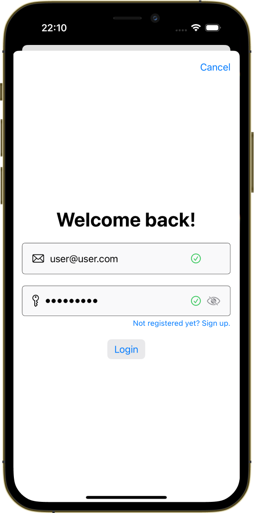
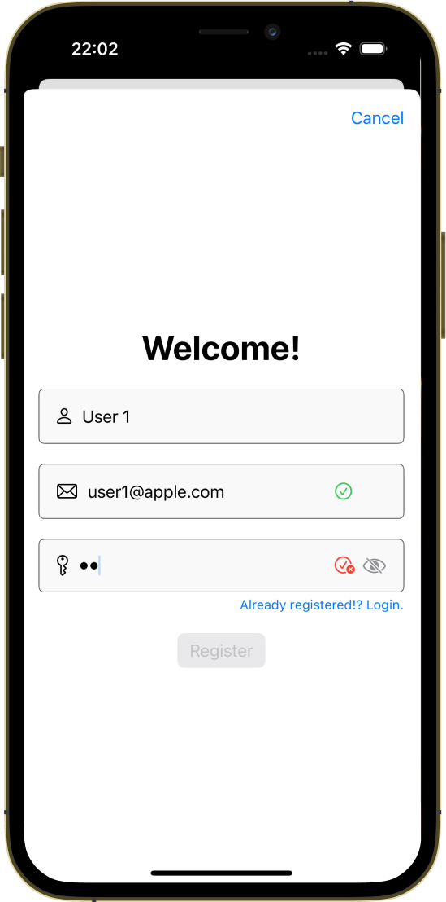

# PerseusKit

Login/Signup view with validation logic for rapid prototyping.

<p float="left">
  
  
  
</p>

## How to install
__Add the repo as submodule to your project:__

```
$ git submodule add https://github.com/kicsipixel/PerseusKit.git
```

__Add to your project's target as local framework__.

## How to use it

```swift
import PerseusKit

@State var isPresented = false

var body: some View {
        VStack { }
         .sheet(isPresented: $isPresented, content: {
        	PerseusLoginView(isPresented: $isPresented)
        })
}

```