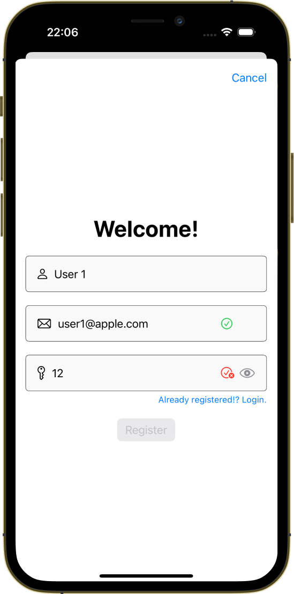

<p>
	
</p>

# PerseusKit
**Login/Register views with validation logic for rapid prototyping.**
> No need to start everytime from scratch...

<p float="left">
  
  
  
</p>

## Installation
__Add the repo as submodule to your project:__

```
$ git submodule add https://github.com/kicsipixel/PerseusKit.git
```

__Init the submodul:__
```
$ git submodule init
```

__Update the submodule:__
```
$ git submodule update
```

__Add to your project's target as local framework__.

## Usage

__Add `PerseusDataViewModel` as `EnvironmentObject` to your view.__

```swift
import PerseusKit

@EnvironmentObject private var perseusDataViewModel: PerseusDataViewModel
@State var isPresented = false

var body: some View {
        VStack { }
         .sheet(isPresented: $isPresented, content: {	
        	PerseusLoginView(isPresented: $isPresented)
        })
}

```

## Todo
- Login email field doesn't need validation
- Easier integration